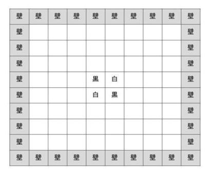

# grpc bidirectional reversi app
- オセロを双方向通信で作ってみた
- room機能あり

## 立ち上げ方
以下の順序
```shell
# ゲームサーバの立ち上げ
go run server/grpc/main.go
# クライアント1(ルームオーナー。黒色)の立ち上げ
go run cmd/main.go
# クライアント2(ルームメンバー。白色)の立ち上げ
go run cmd/main.go
```

## 構造

```
.
├── Dockerfile
├── README.md
├── assets
├── build // DTO. pbパッケージとgameパッケージの構造体の変換
├── client // クライアント側アプリ
├── cmd // クライアント側main関数
├── compose.yaml
├── game // ゲームロジック、構造体。ドメイン
├── gen // 自動生成
├── go.mod
├── handler // gRPCのサービスに対応したハンドラ
├── proto // スキーマ
├── script
└── server
    ├── grpc // gRPCサーバ
    └── handler // gRPCの各サービスに対応したハンドラ
 

```

## 要件
1. マッチング処理
2. Playerがマッチング処理を行った場合、まだ部屋がなければホストとして部屋を作成
3. 部屋があればそのホストとマッチング
4. マッチングの成立はサーバーストリーミングRPCで非同期に受信
5. マッチングが成立したらクライアントは双方向ストリーミングのリクエストをサーバに送信
6. 双方向ストリーミングRPCのリクエストは「ゲーム開始」「リバーシの手」の２種類
7. サーバー側は、プレイヤー双方が「ゲーム開始を送った時」「相手が手を送った時」など状態の変化に応じて、クライアントにレスポンスを返却
8. 構造体はサーバー側、クライアントがわで共用できるようにする。構造体とProtocol Buffersが生成する構造体との変換処理も共用


番兵という手法で範囲外かどうかを確認

## ゲームルール
- 黒白の二色
- 通常のリバーシと同様、8×8のセルに石を打つ。初期状態は黒白2枚ずつ中央に置かれる
- 通常のリバーシと同様に、相手の色の石を自分の色の石で挟むとひっくり返すことができる
- 通常のリバーシとは異なり、連続で打つことができる(あくまで双方向通信の実験のため。ここを制御するなら状態管理で「相手か自分か」と言う状態を増やす必要がある)
- 石を打ったあとは5秒間、次の石を打つことができない
- お互いにおける場所がなくなったらゲーム終了
- ゲーム終了時に石の数が多い方が勝ち。同数であれば引き分け